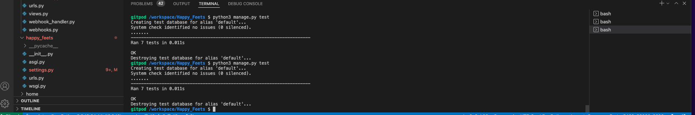
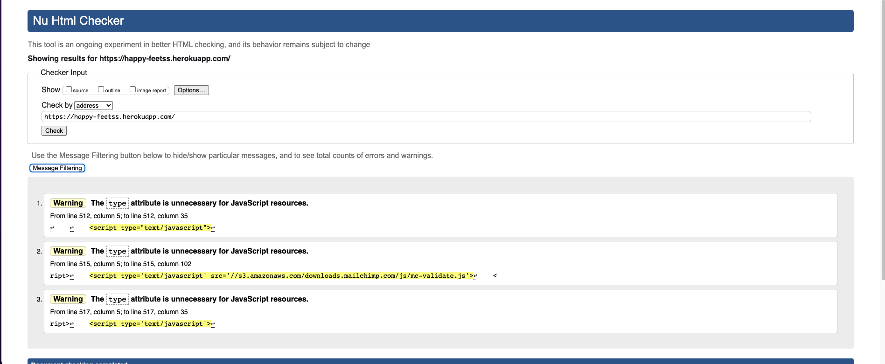
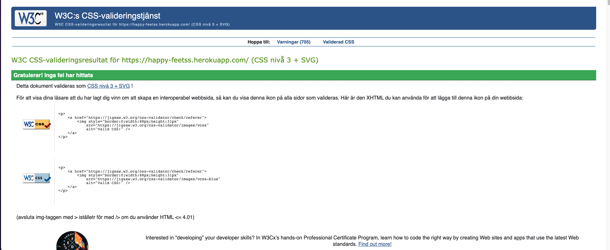
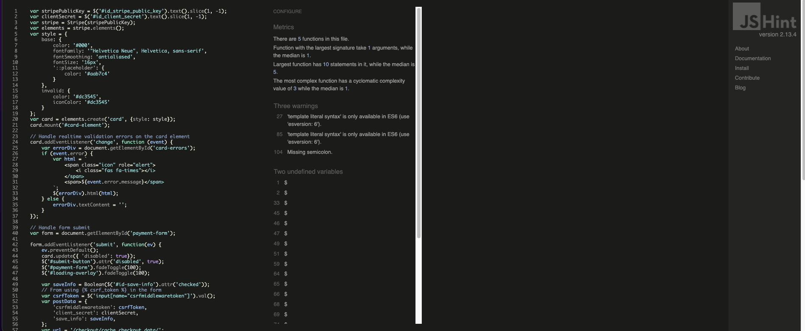
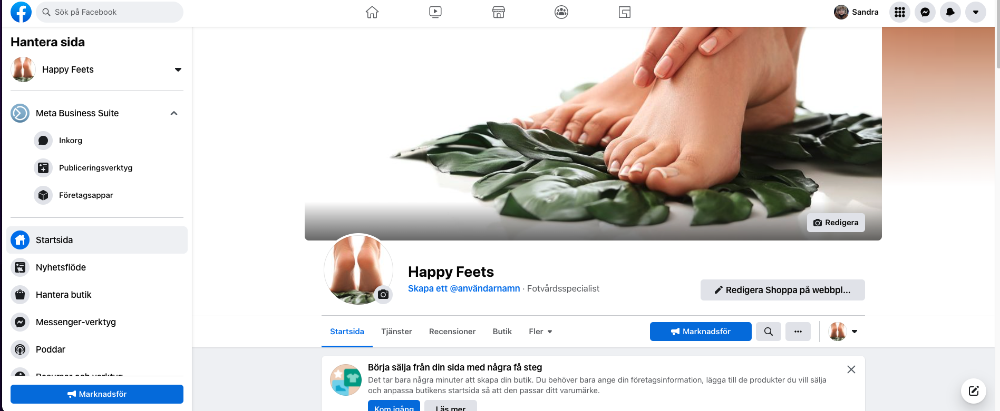
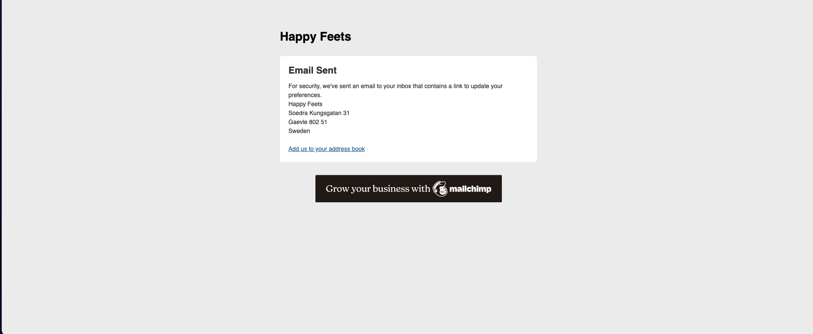

# Testing

## Table of Contents

- [Test Strategy](#teststrategy)

- [User Story Testing](#userstorytesting)

- [Automated Testing](#automatedtesting)

- [Manual Testing](#manualtesting)

- [Bugs / Issues](#bugsissues)

 

## Test Strategy:
---

To test responsiveness of the site [Chrome DevTools](https://developer.chrome.com/docs/devtools/) will be used. This ensures the site is usable on a variety of different devices and screen sizes.

To ensure the site is fit for purpose all user stories and features documented in the main README.md file are to be tested. The test procedures
and results are documented below.

The code (HTML/CSS/JS/Python) must also satisfy the requirements of the online validation tools. These are:
* [W3C Markup Validation Service](https://validator.w3.org/). Check the markup of web documents.
* [W3C CSS Validator](https://jigsaw.w3.org/css-validator/). Check Cascading Style Sheets
* [JS Hint](https://jshint.com/). Javascript code quality tool. 
* [PEP8 Online](http://pep8online.com/). Checks Python code for PEP8 compliance.

Google Lighthouse will be used to check the Performance, Accessibility, Best Practices and Search Engine Optimisation of the website.

 

## User Story Testing:
---

1. Goal: As a customer, I want to be able to navigate the website easily, so that I can have a nice user experience.

    Expected: When the user accesses the website they should be presented with a landing page that presents the main ideas behind the website as well as highlight the most important links.

    Result: The website is designed to be clean and straight to the point. Navigation bar enables the user to visit different pages on the website with ease. Action buttons link to relevant page, content and functions.

 

2. Goal: As a customer, I want to be able to see what the website is providing, so that I can decide if its for me.

    Expected: When the user accesses the website there should be clear and informational content on the site.

    Result: Reaching the landing page the user is presented with a big representive hero image. The landing page contains two sections with some information about the treatments and the shop and action buttons linking to the pages. There´s also a testimonial snippet with reviews from previous customers.

 

3. Goal: As a customer, I want to be able to read some information about the company, so that I can receive historical background.

    Expected: The user should be able to easily find the about page to find more information.

    Result: The user can navigate to the about page. The about page will contain information about the business owner.

 

4. Goal: As a customer, I want to be able to contact the company, so that I can get more information if needed.

    Expected: The should be a contact link from were the customer can get in contact with the business owner.

    Result: A email link is added in the footer from were the customer can email the business owner. 

 

5. Goal: As a customer, I want to be able to search for all the packages/products the company sells, so that I can save time when searching.

    Expected: A search form should be present from where the customer can search for products.

    Result: The customer can enter search criteria through a search input form in the header.

 

6. Goal: As a customer, I want to be able to see the package/product price and description, so that I can determine if the product is affordable.

    Expected: The price and some description should be clear and present for the customer.

    Result: The price is displayed under the image of the product cards and a action to call button for more information is present as well. 

 

7. Goal: As a customer, I want to be able to add and view products in my shopping cart, so that I can see the sub-total, delivery costs and total amounts. 

    Expected: The customer should be able to have a view where the total of products and cost is present.

    Result: The value of the total order is displayed on the shopping bag icon in the navbar and in the bag.

 

8. Goal: As a customer, I want to be able to edit my shopping cart, so that I can change quantities of products or remove them from the cart.

    Expected: The customer should be able to edit the cart.

    Result: The customer edit the cart from the bag view.

 

9. Goal: As a customer, I want to be able to checkout easily and securely, so that I can enter my personal information and payment details with confidence.

    Expected: A payment method and webhooks for secure payment should be installed.

    Result: A stripe payment method and webhooks are installed to ensure secure payment.

 

10. Goal: As a customer, I want to be able to receive confirmation of my order, so that I can get proof that my purchase has been completed.

    Expected: A confirmation email should be sent when the order is purchased successfully.

    Result: Django is configured to send a confirmation email when the order is purchased successfully

 

11. Goal: As a customer, I want to be able to save my personal details to an account, so that I can save time on future purchases.

    Expected: The details of the customer sholud be saved when adding an account.

    Result: The details of the customer will be saved on the My Profile page.

 

12. Goal: As a customer, I want to be able to see my previous order details, so that I can keep track of my orders.

    Expected: The previous orders should be saved for future needs.

    Result: On my profile page the customer can preview previous order.

 

13. Goal: As a customer, I want to be able to leave a review of the product, so that I can share my experience with others.

    Expected: From the product detail view, the customer should be able to leave reviews on any of the products.

    Result: From the product detail view, the customer can leave a review and rating on products if they are logged in. 

 

14. Goal: As a business owner, I want to be able to edit and add products easily, so that I can save time managing the site.

    Expected: While signed in as an admin, the admin should be able to add/edit products directly from the page.

    Result: While on the page the admin can choose to add / edit products via links.

 

15. Goal: As a business owner, I want to be able to delete products, so that I can remove products that are not current.

    Expected: While signed in as a admin, the admin should be able to delete products.

    Result: A delete button available to logged in admin users on all products/treatments cards.

 

16. Goal: As a business owner, I want to be able to have access to an admin section, so that I can easily manage the site.

    Expected: While signed in as a admin, the admin should be able to have access to an admin section. 

    Result: While signed in as a admin, the admin is able to controll the whole site directly from the database.

 

17. Goal: As a business owner, I want to be able to provide easy shopping experience for my customers, so that I can increase the chance of getting returning customers.

    Expected: The customers should experience easy and secure shopping buying products or treatments from the shop. 

    Result: A stripe payment method is added to the app.

 

---
## Automated Testing:
---

### Test Driven Development (TDD)

 

[Django unittest documentation](https://docs.djangoproject.com/en/3.2/topics/testing/overview/)

Using Django's standard unit test library module `unittest`, a class based approach was used to build tests for each app's functionality.

For the checkout app in the project, the following files were tested:
  - `views.py` tested by `test_views.py`
  - `models.py` tested by `test_models.py`
  - `forms.py` tested by `test_forms.py`

    

    
Click to see result

    
    

 

### Validation Services 

- [W3C Markup Validation Service](https://validator.w3.org/) - For testing HTML code.
    
    

    
Click to see result

    
    

    - No errors.

     

- [W3C CSS Validation Service](https://jigsaw.w3.org/css-validator/) - For testing CSS code.

    

    
Click to see result

    
    

    - No errors. 

     
    
- [PEP8 Online](http://pep8online.com/) - For checking Python PEP8 requirements. 
   
    Errors shown: 
    - Line length - Fixed
    - Missing module docstring - Not Fixed.
    - Missing class docstring - Not Fixed.

     

- [JSHint](https://jshint.com/) - For checking Javascript code.

    

    
Click to see result

    
    

   
    - No errors. 
    - 3 warnings: 'template literal syntax' is only available in ES6 (use 'esversion: 6') and Missing semicolon. Theese warnings are ignored at this stage.

     

- [Chrome DevTools](https://developers.google.com/web/tools/chrome-devtools) 
    - For testing the site through out with different responsive media frames.  
    - For style checking and debugging.
    - For testing performance with Lighthouse.

 

---
## Manual Testing
---

### Responsive Testing:

 

**Mobile & Tablet**

The responsiveness of the site was tested using the Device Mode in [Chrome DevTools](https://developer.chrome.com/docs/devtools/). For mobile devices the minimum screen width the site was tested at was 320 pixels (iPhone SE). The following mobile and tablet options were tested in [Chrome DevTools](https://developer.chrome.com/docs/devtools/):

- iPhone 5/SE, iPhone 6/7/8, iPhone 6/7/8 Plus, iPhone X, iPad, iPad Pro, 

**Desktop**

The responsiveness of the site on desktop devices was tested using Chrome browser. The site was tested using the following screen widths:

- 1024 pixels, 1280 pixels, 1440 pixels, 1600 pixels and 1920 pixels.

The site was consistently responsive across all devices and screen sizes with the layout responding as expected.

**This project was tested with the following external browsers:** 
- Laptop MacOS Big Sur (ver 11.4): Google Chrome
- Mobile OnePlus Pro 9: Google Chrome

 

### Functional/Features Testing:

 

**The following steps were taken:**

- Manually testing via Devtools 
- Test navigation bar links function correctly and that the correct links are displayed for admin and non admin users - works.
- Click each of the menu options listed above and confirm that you are taken to the correct page - works.
- Clicking the Logout option should log you out of the website - works.
- Login in using an administrator account and check that the following options appear in the nav bar: Product Management, My Profile & Logout - works.
- Confirm that all the navigation links under the menu drop down menu function correctly. On mobile devices these will collapse into a hamburger icon - works.
- Test footer links function works correctly - works.
- Click on the facebook link and verify it opens up the correct page in a new browser tab - works.
    

    
Click to see result

    
    

- Test news letter subscribe and verify it return correct result - works.
    

    
Click to see result

    
    

- Clear user experience & navigation - works.
- Login/register/logout functionalities - works.
- Alert messeges shown when logged in/out - works.
- Edit, add, delete products function for admin - works.

 

## Bugs / Issues:
---

- 
- 
- 
-  

